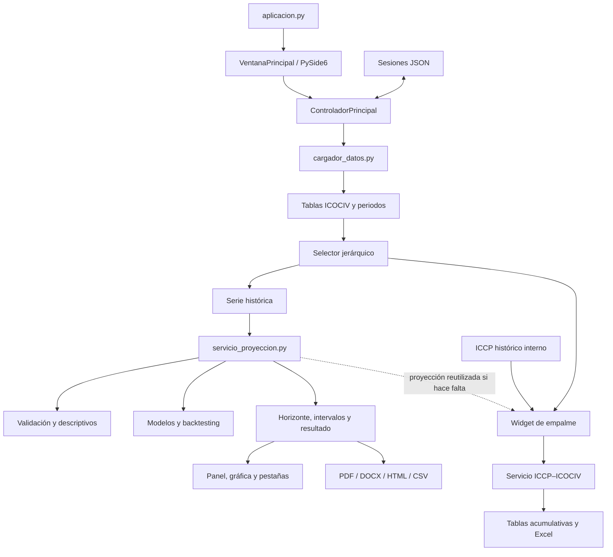

# Arquitectura

## Vista general

La aplicación usa una arquitectura modular sin framework web. `aplicacion.py` inicia PySide6. La ventana principal captura entradas, el controlador conserva tablas y selección, y los servicios ejecutan carga, proyección o empalme. Los módulos estadísticos no dependen de widgets; los reportes consumen resultados ya estructurados.

## Capas y responsabilidades

- **Entrada/UI:** `app_icociv/interfaz/`; construye formularios, pestañas, tablas y mensajes.
- **Coordinación:** `interfaz/controladores/`; conecta entradas con servicios sin redefinir fórmulas.
- **Datos:** `datos/cargador_datos.py`; detecta encabezados, periodos y bloques de tablas.
- **Dominio estadístico:** `estadistica/`, `validacion/` y `proyeccion/`.
- **Dominio contractual:** `servicios/empalme_iccp_icociv.py` y su widget.
- **Salidas:** `reportes/`, `exportables/` y `persistencia/`.
- **Configuración:** `config/rutas.py`; rutas relativas a la raíz del proyecto.

## Flujo de datos

1. El usuario elige un archivo; `cargar_todas_tablas` produce tablas y periodos.
2. `ControladorPrincipal` expone opciones jerárquicas y resuelve una fila.
3. La serie seleccionada entra a `ejecutar_proyeccion`, que valida, compara candidatos, evalúa horizontes y estructura el resultado.
4. La ventana actualiza resultados, serie, fila fuente, gráfica, explicación y metodología; el mismo resultado alimenta reportes.
5. El empalme recibe una serie ICCP, una ruta ICOCIV y valores contractuales. Si requiere un índice futuro, la ventana reutiliza el flujo de proyección existente.
6. Los cálculos válidos se acumulan en memoria y pueden exportarse a Excel.

Las rutas persistentes se resuelven desde `app_icociv/config/rutas.py`; no deben reemplazarse por rutas personales.
